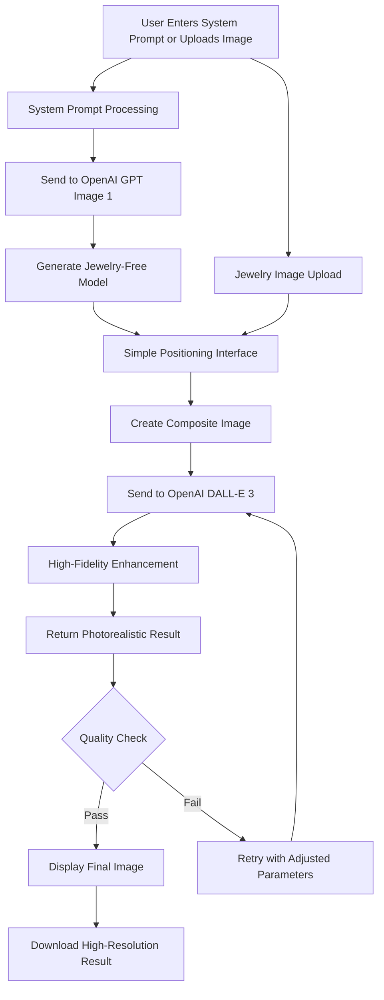
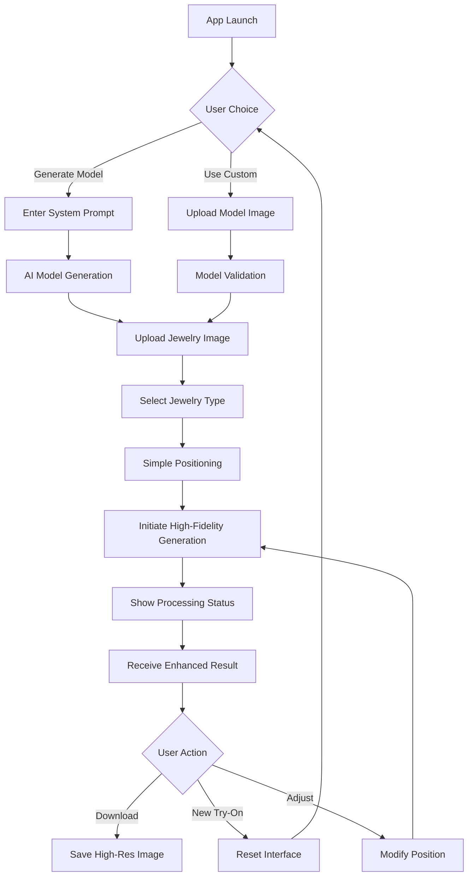
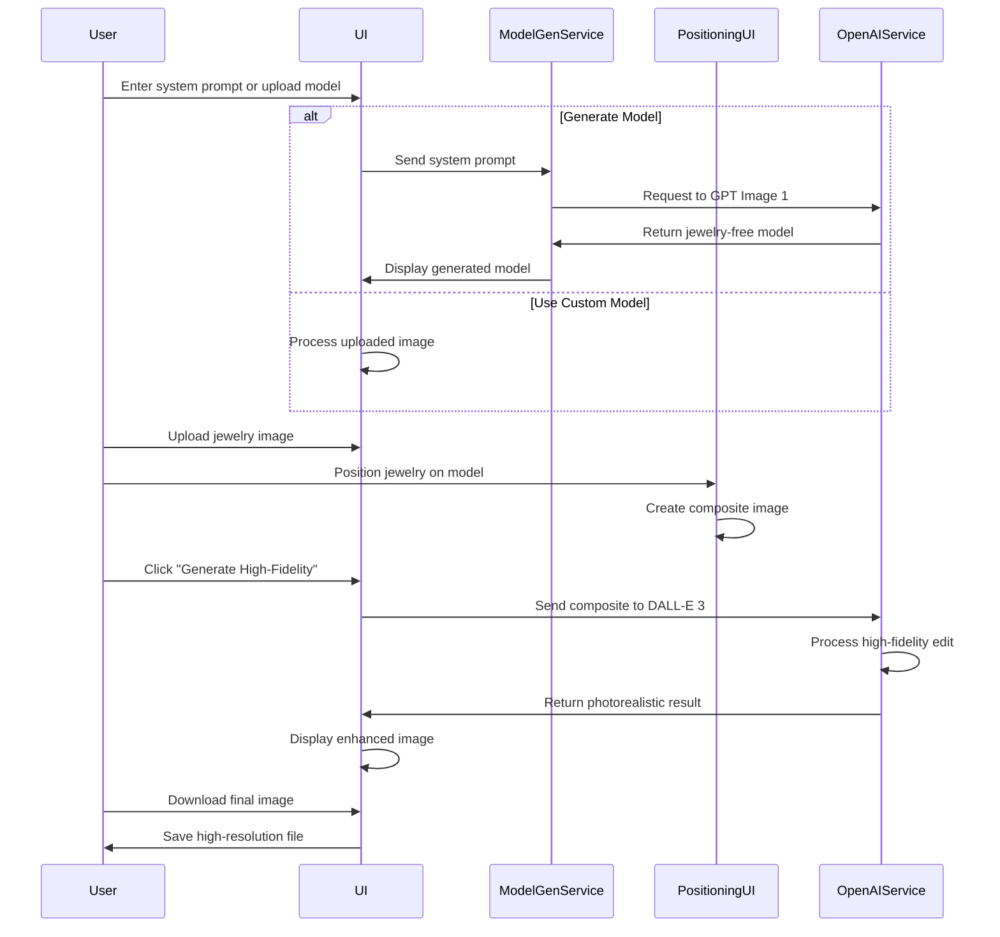
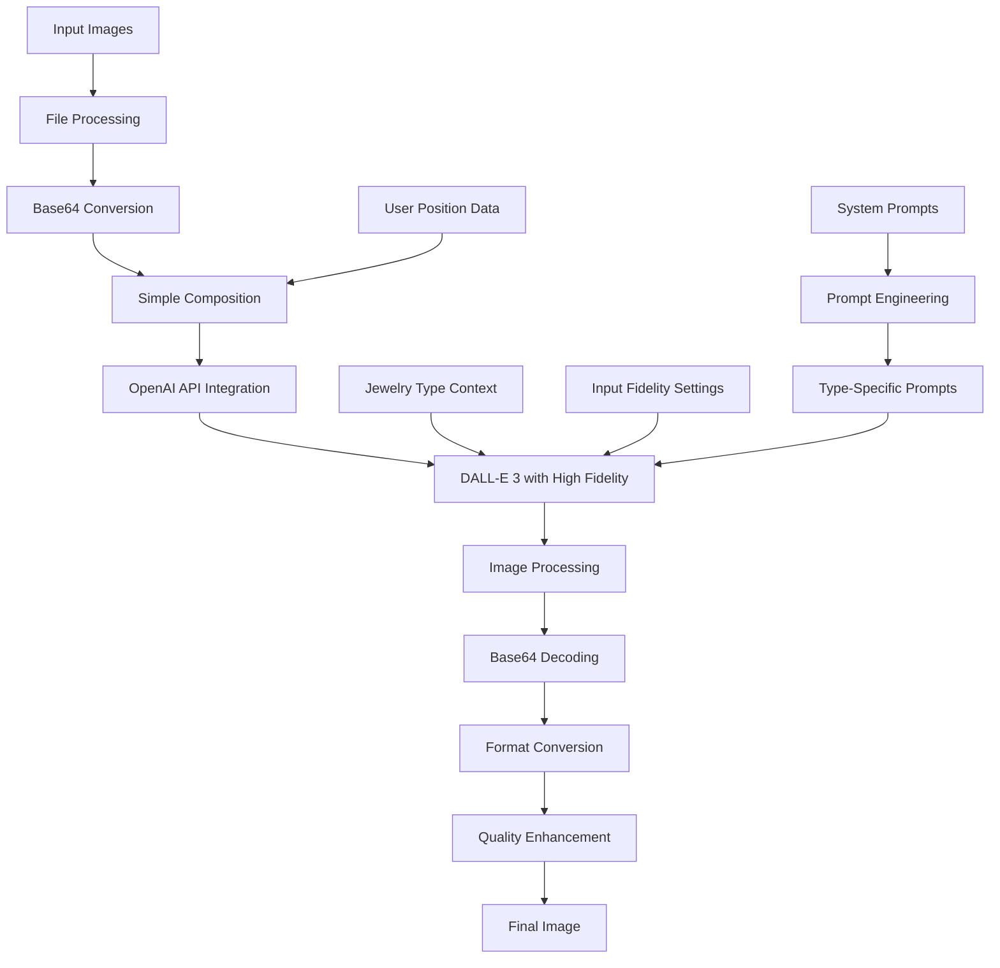

# 🎯 AI-Powered Jewelry Virtual Try-On System
## Design Document v2.0


---

## 🎯 System Overview

The AI-Powered Jewelry Virtual Try-On System is a sophisticated web application that allows users to virtually try on jewelry pieces using OpenAI's advanced image generation models. The system now focuses on high-fidelity photorealistic results rather than manual canvas manipulation, utilizing GPT Image 1 for model generation and DALL-E 3 for the final high-fidelity jewelry try-on.

### Key Features
- **High-Fidelity Generation** using OpenAI's advanced models
- **Photorealistic Results** that look like professional photography
- **Simple Positioning Interface** for jewelry placement
- **Custom Model Generation** via system prompts
- **Professional Studio Quality** outputs
- **Cross-platform Compatibility** for all devices


---

## 🧩 Core Components

### 1. HighFidelityJewelry Component
The main React component that orchestrates the high-fidelity jewelry try-on experience.

**Key Responsibilities:**
- Simple positioning interface
- Jewelry image management
- API integration with OpenAI services
- Result preview and download functionality

### 2. Model Generation Service
AI-powered service for generating custom jewelry-free models using system prompts.

**Key Responsibilities:**
- Custom prompt handling
- OpenAI GPT Image 1 integration
- Jewelry-free model validation
- Error handling and retry logic

### 3. High-Fidelity Enhancement Service
Advanced image generation service for photorealistic jewelry integration.

**Key Responsibilities:**
- OpenAI DALL-E 3 integration
- High-fidelity composite generation
- Image transformation and file conversion
- Result validation

---

## 🤖 AI Image Generation Pipeline



---

## 🎨 User Interface Flow



---

## 📊 Data Flow



---

## 🔧 API Specifications

### High-Fidelity Jewelry API

**Endpoint:** `POST /api/high-fidelity-jewelry`

**Request:**
```json
{
  "personImage": "base64_encoded_image_data",
  "jewelryImage": "base64_encoded_image_data",
  "jewelryType": "necklace|ring|earrings|bracelet",
  "positionData": {
    "x": 600,
    "y": 320
  }
}
```

**Response:**
```json
{
  "success": true,
  "resultImage": "base64_encoded_enhanced_image",
  "processingTime": 4.2,
  "validation": {
    "isValid": true,
    "naturalness": 0.92,
    "quality": "high"
  }
}
```

### Model Generation API

**Endpoint:** `POST /api/model-generation`

**Request:**
```json
{
  "systemPrompt": "High-fashion portrait photograph of a stunning South Asian woman...",
  "jewelryType": "necklace|ring|earrings|bracelet",
  "options": {
    "lighting": "studio",
    "pose": "neck-visible|hand-extended|ear-visible|default",
    "background": "neutral"
  }
}
```

**Response:**
```json
{
  "success": true,
  "modelImage": "base64_encoded_model_image",
  "validation": {
    "isJewelryFree": true,
    "confidence": 0.95,
    "poseQuality": "excellent"
  }
}
```

---

## 🎭 High-Fidelity Generation System



### OpenAI Integration

1. **Model Generation**: `GPT Image 1` for jewelry-free model creation
2. **High-Fidelity Editing**: `DALL-E 3` with `input_fidelity: "high"` setting
3. **Prompt Engineering**: Specialized prompts for each jewelry type
4. **Image Processing**: Base64 conversion for API compatibility
5. **Error Handling**: Automatic retry logic and validation

---

## ⚙️ Technical Implementation

### State Management Structure

```typescript
interface VirtualTryOnState {
  jewelryImage: File | null;
  customModel: File | null;
  systemPrompt: string;
  jewelryType: string;
  dimensions: {
    width: string;
    height: string;
    depth: string;
  };
  currentPosition: { x: number; y: number };
  isProcessing: boolean;
  resultImage: string | null;
  modelImageData: string | null;
  jewelryImageData: string | null;
}
```

### High-Fidelity API Integration

```typescript
// OpenAI API Integration for High-Fidelity Editing
async function enhanceJewelryImage(composite: File, prompt: string) {
  const formData = new FormData();
  formData.append("image", composite);
  formData.append("prompt", prompt);
  formData.append("input_fidelity", "high");
  
  const response = await fetch("https://api.openai.com/v1/images/edits", {
    method: "POST",
    headers: {
      "Authorization": `Bearer ${process.env.OPENAI_API_KEY}`
    },
    body: formData
  });
  
  const data = await response.json();
  return data.data[0].b64_json;
}
```

### System Prompt Engineering

The system uses sophisticated prompts for each jewelry type:

**Necklace Enhancement:**
```
Create a photorealistic image of a person wearing elegant jewelry. 
The person is wearing a beautiful necklace that drapes naturally 
around their neck and chest. The necklace should have realistic 
weight, proper perspective, authentic metallic shine, and cast 
natural shadows on the skin.
```

**Ring Enhancement:**
```
The person is wearing a stunning ring on their finger. The ring 
should fit naturally, follow the finger's contours, have authentic 
metallic reflections, and appear to have realistic weight and presence.
```

---


### Development Commands

```bash
npm run dev          # Start development server
npm run build        # Build for production  
npm run lint         # Code linting
npm run type-check   # TypeScript validation
```

---
